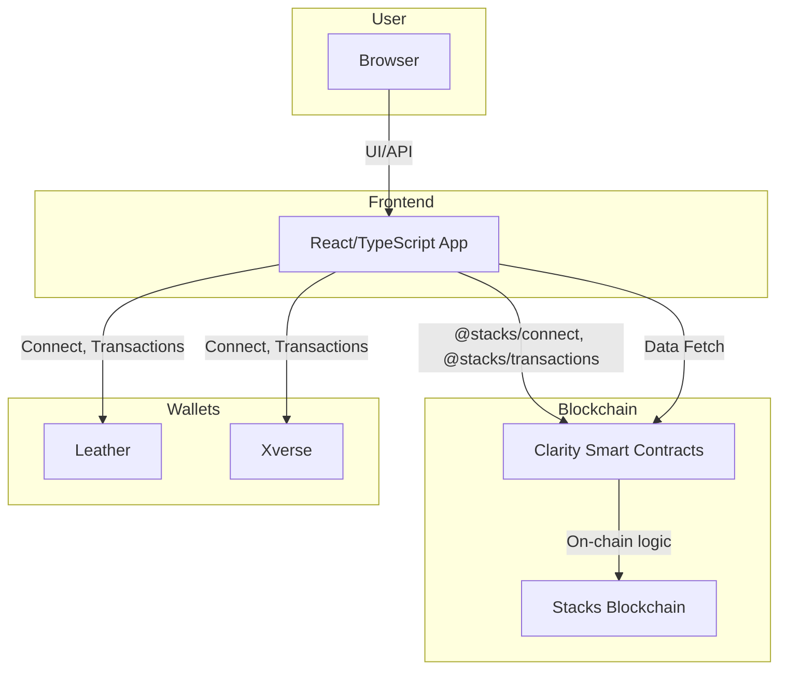
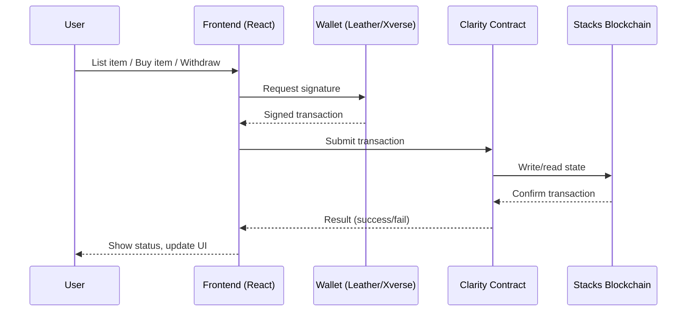

# SatoshiFarm

<p align="center">
	<a href="https://stacks.co/"></a>
	<a href="https://clarity-lang.org/"></a>
	<a href="https://www.circle.com/en/usdc-multichain/usdcx"></a>
</p>


<p align="center"><b>Empowering farmers with direct, secure, and stablecoin-enabled commerce on the Stacks blockchain.</b></p>

---

## Table of Contents

1. [Project Overview](#project-overview)
2. [Features](#features)
3. [Architecture](#architecture)
4. [System Integration](#system-integration)
5. [Project Structure](#project-structure)
6. [Getting Started](#getting-started)
7. [Usage](#usage)
8. [Contributing](#contributing)
9. [License](#license)

---

---


## Project Overview

SatoshiFarm is a decentralized marketplace built on the Stacks blockchain, enabling farmers to sell agricultural products directly to buyers with no intermediaries. The platform supports payments in both STX and USDCx stablecoin, providing a seamless, secure, and transparent experience for both sellers and buyers. SatoshiFarm leverages Clarity smart contracts for on-chain logic and a modern React/TypeScript frontend for user interaction.

---

---

---


## Features

- **Direct-to-Buyer Sales:** Farmers list and sell products directly, no middlemen
- **Dual Payment Support:** Accepts both STX and USDCx stablecoin
- **Secure Treasury:** Escrow and withdrawal for stablecoin payments
- **Farmer-First UX:** Effortless product listing, inventory, and earnings tracking
- **Wallet Integration:** Supports Leather and Xverse wallets
- **Open Source & Audited:** Fully open, with comprehensive tests
- **Modern Tech Stack:** Clarity smart contracts, React/TypeScript frontend

---


## Architecture

### High-Level System Structure



---

## System Integration

### User Flow: Listing, Buying, and Withdrawing



---

## Project Structure

- `clarityContract/` — Clarity smart contracts and tests (Stacks)
- `frontend/` — Web frontend for user interaction
- `solidityContract/` — (Planned) Solidity contracts for future expansion

---

### System Integration


## Getting Started

### Prerequisites
- [Clarinet](https://github.com/hirosystems/clarinet) (for Clarity contracts)
- Node.js & npm

### Quick Start

```bash
# Clone the repository
git clone <repository-url>
cd satoshiFarm

# Install Clarity contract dependencies
cd clarityContract
npm install
```


### Usage

#### List a Product (Farmer)
1. Connect your wallet (Leather/Xverse)
2. Go to "List Product" and enter details
3. Confirm the transaction in your wallet

#### Buy a Product (Buyer)
1. Connect your wallet
2. Browse available products
3. Click "Buy" and confirm payment (STX or USDCx)

#### Withdraw Earnings (Farmer)
1. Go to "Withdraw" section
2. Choose STX or USDCx
3. Confirm withdrawal in your wallet

### Run Tests

```bash
clarinet check
npm test
```

---


## Contributing

We welcome your ideas and code! Fork the repo, create a feature branch, and submit a pull request after testing your changes.

---


## License

MIT License — see LICENSE for details.

---

---

<p align="center"><sub>Built for farmers, on Stacks and beyond.</sub></p>

