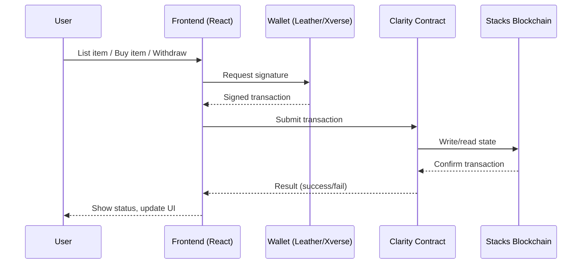

# SatoshiFarm

<p align="center">
	<a href="https://stacks.co/"></a>
	<a href="https://clarity-lang.org/"></a>
	<a href="https://www.circle.com/en/usdc-multichain/usdcx"></a>
</p>


<p align="center"><b>Empowering farmers with direct, secure, and stablecoin-enabled commerce on the Stacks blockchain.</b></p>

---


## What is SatoshiFarm?

SatoshiFarm is a decentralized marketplace built on Stacks, designed to help farmers sell their products directly to buyers—no middlemen, no barriers. With support for STX and USDCx stablecoin payments, SatoshiFarm brings real-world agriculture to Web3, making it easy for anyone to buy and sell farm goods securely and transparently.

---

---


## Features

- Dual Payment Support: Accepts both STX and USDCx stablecoin
- Farmer-First UX: Effortless product listing, inventory, and earnings tracking
- Secure Treasury: Escrow and withdrawal for stablecoin payments
- Open Source & Audited: Fully open, with comprehensive tests
- Modern Tech Stack: Built with Clarity smart contracts and a React/TypeScript frontend

---


## Project Structure

```mermaid
graph TD
	A[frontend (React/TypeScript)] -->|Stacks.js, @stacks/connect| B[clarityContract (Clarity)]
	B --> C[Stacks Blockchain]
	A --> D[User Wallets (Leather, Xverse)]
	D --> A
```

- `clarityContract/` — Clarity smart contracts and tests (Stacks)
- `frontend/` — Web frontend for user interaction
- `solidityContract/` — (Planned) Solidity contracts for future expansion

---

### System Integration




## Getting Started

### Prerequisites
- [Clarinet](https://github.com/hirosystems/clarinet) (for Clarity contracts)
- Node.js & npm

### Quick Start

```bash
# Clone the repository
git clone <repository-url>
cd satoshiFarm

# Install Clarity contract dependencies
cd clarityContract
npm install
```


### Run Tests

```bash
clarinet check
npm test
```

---


## Contributing

We welcome your ideas and code! Fork the repo, create a feature branch, and submit a pull request after testing your changes.

---


## License

MIT License — see LICENSE for details.

---

---

<p align="center"><sub>Built for farmers, on Stacks and beyond.</sub></p>

