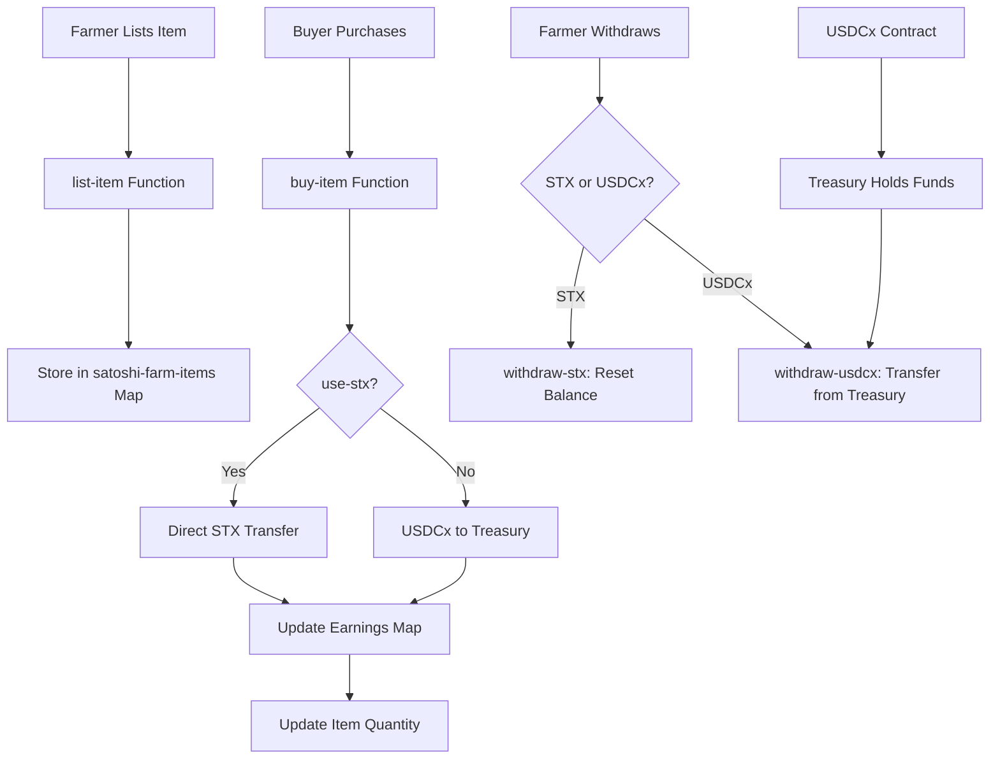
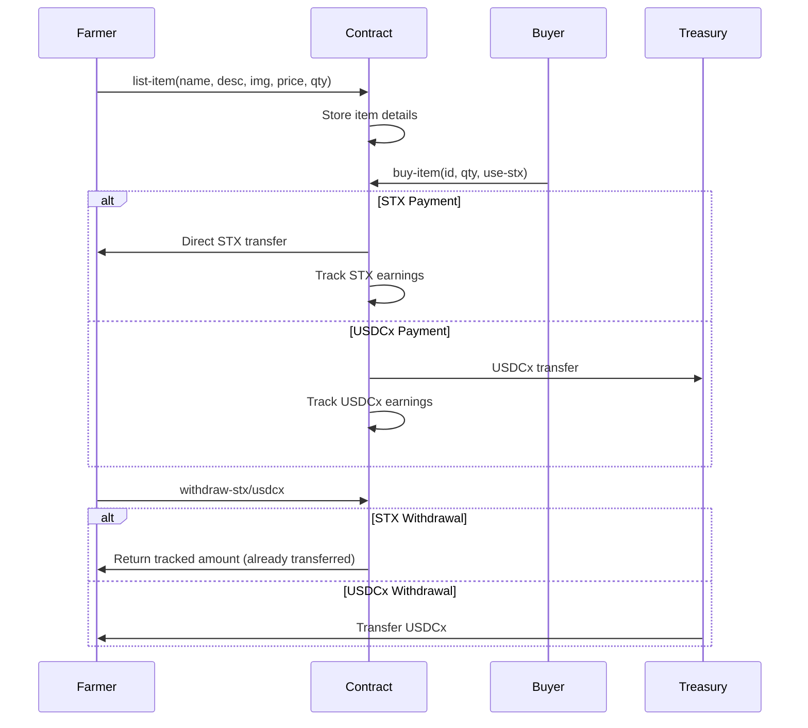

# SatoshiFarm

[](https://stacks.co/)
[](https://clarity-lang.org/)
[](https://www.circle.com/en/usdc-multichain/usdcx)

A decentralized marketplace for farmers on the Stacks blockchain, enabling direct sales of agricultural products using STX and USDCx stablecoin.

## Features

- **Dual Payment Support**: Accept payments in STX (direct transfers) or USDCx (escrow via treasury)
- **Image URLs**: Rich product listings with image support
- **Treasury System**: Secure holding of USDCx funds with withdrawal functionality
- **Real-time Tracking**: Track earnings and inventory for sellers
- **Tested & Audited**: Comprehensive test suite and deployment-ready

## Table of Contents

- [Installation](#installation)
- [Usage](#usage)
- [Contract Architecture](#contract-architecture)
- [Functions](#functions)
- [Deployment](#deployment)
- [Testing](#testing)
- [Contributing](#contributing)
- [License](#license)

## Installation

### Prerequisites

- [Clarinet](https://github.com/hirosystems/clarinet) installed
- Node.js and npm for testing

### Setup

```bash
# Clone the repository
git clone <repository-url>
cd satoshi-farm

# Install dependencies
npm install

# Check contracts
clarinet check

# Run tests
npm test
```

## Usage

### For Farmers (Sellers)

1. **List Products**: Call `list-item` with product details and price
2. **Track Sales**: Monitor earnings via `get-seller-stx-earnings` or `get-seller-usdcx-earnings`
3. **Withdraw Earnings**: Use `withdraw-stx` or `withdraw-usdcx` to claim funds

### For Buyers

1. **Browse Items**: Query available products with `get-item`
2. **Purchase**: Call `buy-item` with item ID, quantity, and payment type
3. **Payment Options**: Choose STX for instant transfer or USDCx for escrow

## Contract Architecture



### Data Structures

- **satoshi-farm-items**: Maps item IDs to product details (name, description, image-url, price, quantity, seller, active)
- **seller-stx-earnings**: Tracks STX earnings per seller
- **seller-usdcx-earnings**: Tracks USDCx earnings per seller

### Payment Flow



## Functions

### Public Functions

#### `list-item`
```clarity
(list-item (string-ascii 100) (string-ascii 200) (string-ascii 200) uint uint) -> (response uint uint)
```
Lists a new item for sale. Requires name, description, image URL, price, and quantity.

#### `buy-item`
```clarity
(buy-item uint uint bool) -> (response bool uint)
```
Purchases items. Parameters: item-id, quantity, use-stx (true for STX direct transfer, false for USDCx escrow to treasury).

#### `withdraw-stx`
```clarity
(withdraw-stx) -> (response uint uint)
```
Withdraws STX earnings (resets balance, funds already transferred).

#### `withdraw-usdcx`
```clarity
(withdraw-usdcx) -> (response uint uint)
```
Withdraws USDCx earnings from treasury.

### Read-Only Functions

#### `get-item`
```clarity
(get-item uint) -> (optional {name: (string-ascii 100), description: (string-ascii 200), image-url: (string-ascii 200), price: uint, quantity: uint, seller: principal, active: bool})
```
Retrieves item details by ID.

#### `get-next-item-id`
```clarity
(get-next-item-id) -> uint
```
Returns the next available item ID.

#### `get-seller-stx-earnings`
```clarity
(get-seller-stx-earnings principal) -> uint
```
Gets STX earnings for a seller.

#### `get-seller-usdcx-earnings`
```clarity
(get-seller-usdcx-earnings principal) -> uint
```
Gets USDCx earnings for a seller.

## Deployment

### Testnet Deployment

```bash
# Generate deployment plan
clarinet deployments generate --testnet --medium-cost

# Apply deployment
clarinet deployments apply --testnet
```

### Mainnet Deployment

⚠️ **Warning**: Mainnet deployment is irreversible and requires real STX.

```bash
# Update USDCx contract reference in toshi-farm.clar
# Change 'ST1PQHQKV0RJXZFY1DGX8MNSNYVE3VGZJSRTPGZGM.usdcx
# To 'SP120SBRBQJ00MCWS7TM5R8WJNTTKD5K0HFRC2CNE.usdcx

# Generate mainnet plan
clarinet deployments generate --mainnet --high-cost

# Apply deployment
clarinet deployments apply --mainnet
```

## Testing

```bash
# Run all tests
npm test

# Run specific test
npm test -- toshi-farm.test.ts

# Generate coverage
npm run test:coverage
```

Test coverage includes:
- Item listing and validation
- STX and USDCx purchases
- Earnings tracking and withdrawal
- Error conditions and edge cases

## Contributing

1. Fork the repository
2. Create a feature branch
3. Make changes and add tests
4. Ensure all tests pass
5. Submit a pull request

## License

MIT License - see LICENSE file for details.

---

Built with love on the Stacks blockchain for farmers worldwide.</content>
<parameter name="filePath">README.md