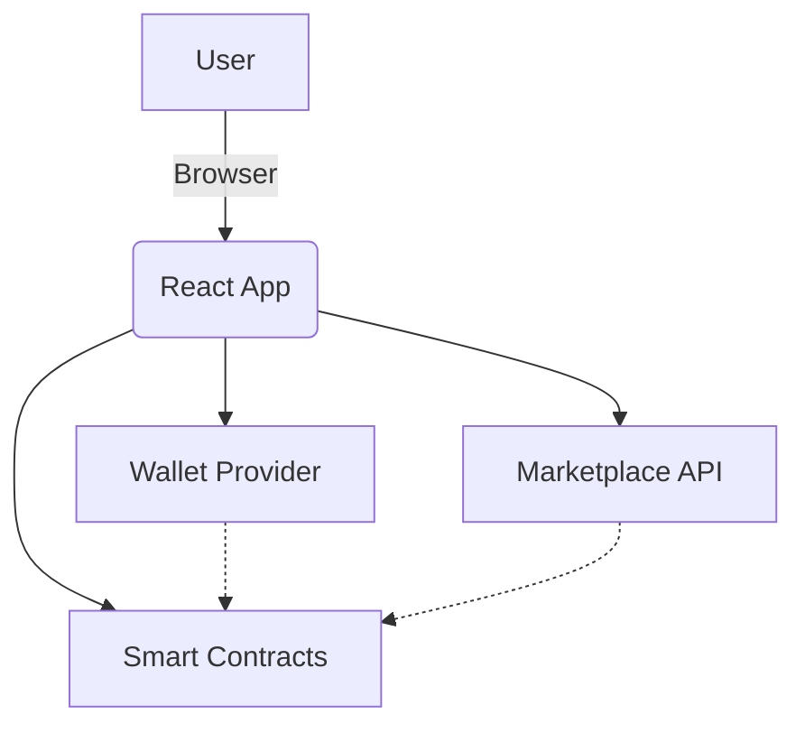

# SatoshiFarm Frontend


---

## Description

SatoshiFarm is a professional, high-performance decentralized application (dApp) frontend for blockchain-based farming and digital asset marketplaces. It is designed for clarity, scalability, and ease of use, providing a seamless interface for interacting with smart contracts and decentralized protocols. The project leverages modern web technologies and a modular architecture to ensure maintainability and rapid development.

## Tech Stack


---

## Table of Contents

- [SatoshiFarm Frontend](#satoshifarm-frontend)
  - [Description](#description)
  - [Tech Stack](#tech-stack)
  - [Table of Contents](#table-of-contents)
  - [Project Overview](#project-overview)
  - [Features](#features)
  - [Tech Stack](#tech-stack-1)
  - [Getting Started](#getting-started)
    - [Prerequisites](#prerequisites)
    - [Installation](#installation)
    - [Running the Development Server](#running-the-development-server)
    - [Building for Production](#building-for-production)
  - [Project Structure](#project-structure)
  - [Development](#development)
  - [Testing](#testing)
  - [Architecture Diagram](#architecture-diagram)
  - [License](#license)

---

## Project Overview

SatoshiFarm is a decentralized marketplace on the Stacks blockchain, empowering farmers to sell agricultural products directly to buyers and accept payments in STX and USDCx stablecoin. Built for transparency, security, and ease of use, SatoshiFarm removes intermediaries and enables real-world commerce on Web3 rails.

## Features

- Decentralized marketplace for digital assets
- Wallet integration and management
- Real-time earnings and transaction history
- Advanced filtering and search
- Responsive UI with modern component library
- Modular and maintainable codebase

## Tech Stack

- **Framework:** React, Vite
- **Language:** TypeScript
- **UI:** shadcn-ui, Tailwind CSS
- **State Management:** React Context, React Query
- **Testing:** Vitest, Testing Library

## Getting Started

### Prerequisites

- Node.js (v18+ recommended)
- npm or bun

### Installation

```sh
git clone https://github.com/your-org/satoshifarm-frontend.git
cd satoshifarm-frontend
npm install
# or
bun install
```

### Running the Development Server

```sh
npm run dev
# or
bun run dev
```

### Building for Production

```sh
npm run build
```

## Project Structure

```
frontend/
├── public/
├── src/
│   ├── components/
│   ├── contexts/
│   ├── hooks/
│   ├── lib/
│   ├── pages/
│   └── test/
├── package.json
├── vite.config.ts
└── ...
```

## Development

- Lint code: `npm run lint`
- Run tests: `npm run test`
- Preview build: `npm run preview`

## Testing

This project uses [Vitest](https://vitest.dev/) and [Testing Library](https://testing-library.com/) for unit and integration tests.

```sh
npm run test
```

## Architecture Diagram



## License

This project is licensed under the MIT License. See the [LICENSE](LICENSE) file for details.
